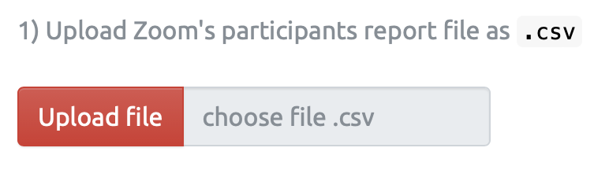
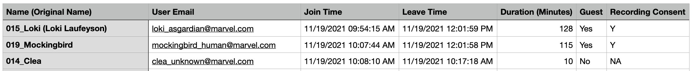
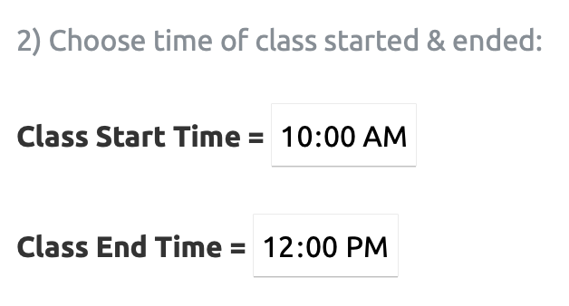
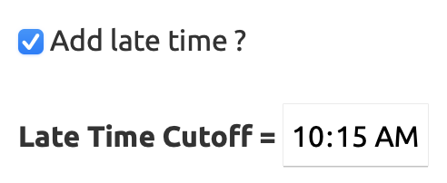
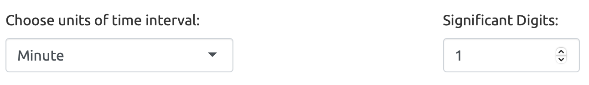
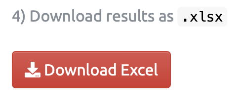

```{r setup, include=FALSE}
knitr::opts_chunk$set(echo = TRUE, message = FALSE, warning = FALSE)
```

# คู่มือการใช้งาน Zoom Interface App

<br>

> **Web application ช่วยเช็คชื่อนักศึกษา จาก Zoom participant report (`.csv`) และ รวบ Zoom chat file จาก `.txt` เป็น excel**

------------------------------------------------------------------------

**App Link: [`https://si-physio-intern.shinyapps.io/zoom_interface`](https://si-physio-intern.shinyapps.io/zoom_interface/)**

------------------------------------------------------------------------

### App นี้มีอยู่ 2 menu

1.  **Zoom Class Report:** สำหรับเช็คชื่อนักศึกษา จากรายชื่อ Zoom participant report (`.csv`)
2.  **Zoom Chat Converter:** สำหรับแปลงไฟล์ Zoom chat จาก `.txt` เป็น excel

{width="512"}

------------------------------------------------------------------------

# Zoom Class Report

### วิธีใช้

1.  **Upload Zoom Participant Report** `.csv`
2.  **Choose Time:** Class Start Time, Class End Time, Late Cutoff
3.  **Upload File ID:** ที่มี column `Name` เป็นรายชื่อนักศึกษา และ `ID` เป็นรหัสนักศึกษา 7 หลัก
4.  **Results:** สามารถดูผลลัพท์จากตารางที่แสดงใน App และ Download ผลเป็น Excel ได้

------------------------------------------------------------------------

## 1. Upload Zoom Participant Report

{width="358"}

Zoom participant report เป็นไฟล์ `.csv` ที่ host สามารถ download มาได้จากโปรแกรม Zoom ซึ่งโดย default แล้ว จะมี column ดังนี้:

-   **Name (Original Name):** เริ่มต้นด้วยชื่อที่แสดงใน Zoom และชื่อ Original Name ที่ตั้งไว้ก่อนจะเข้า Zoom ในวงเล็บข้างท้าย
-   **User Email:** เป็น email ที่ผู้เข้าร่วมที่ signed in สำหรับ Zoom account
-   **Join Time:** เวลาที่ผู้เข้าร่วม join meeting ในแต่ละ session
-   **Leave Time:** เวลาที่ผู้เข้าร่วม leave meeting ในแต่ละ session
-   **Duration (Minutes):** คิดจาก `Leave Time` - `Join Time` ของแต่ละ session
-   **Guest:** "Yes" หมายถึง participants; "No" หมายถึง host
-   **Recording Consent:** "Y" หมายถึงมีการยินยอมให้ record ใน zoom

### รูปตัวอย่าง Zoom Participant Report `.csv`



------------------------------------------------------------------------

## 2. Choose Time

ใส่ **Class Start Time** เป็น เวลาที่เริ่มคาบเรียน และ **Class End Time** เป็น เวลาที่คาบจบ

{width="295"}

หากต้องการคำนวนเวลามาสาย ให้ติ๊กปุ่ม **Add late time ?**

จากนั้นใส่ **Late Time Cutoff** ซึ่งหมายถึง เวลาที่ตัดว่า ถ้านักเรียนมาเข้า Zoom สายกว่าเวลานี้ จะถือว่าสาย และจะมีคำนวนเวลาให้ว่าสายกี่นาทีด้วย

{width="244"}

<br>

**สรุป** : จากตัวอย่างในรูปด้านบน ตั้งค่าให้ เวลาเริ่ม 10:00 น. เวลาจบ 12:00 น. โดยตัดสายเมื่อนักเรียนเข้า Zoom ครั้งแรก ช้ากว่า 10:15 น. เป็นต้นไป

<br>

**Drop down: Choose units of time interval:** สำหรับเลือกว่าให้ผลลัพท์ของช่วงเวลาออกมาในหน่วยใด เช่น Minute, Hour, Second, หรือ Display Text (HMS) คือแสดงเป็นข้อความ

**Significant Digits:** สำหรับเลือกจุดทศนิยมว่ากี่ตำแหน่ง

{width="550"}

------------------------------------------------------------------------

## 3. Upload File ID

{width="294"}

ให้ Upload file รายชื่อนักศึกษา (File ID) โดยต้องมี column ที่ตั้งชื่อว่า `Name` มีข้อมูลชื่อนักศึกษา และ column `ID` มีข้อมูลรหัสนักศึกษา 7 หลัก

------------------------------------------------------------------------

## 4. Results

สามารถดูผลลัพท์จากตารางที่แสดงใน App หรือ Download เป็น Excel file ได้

{width="241"}
