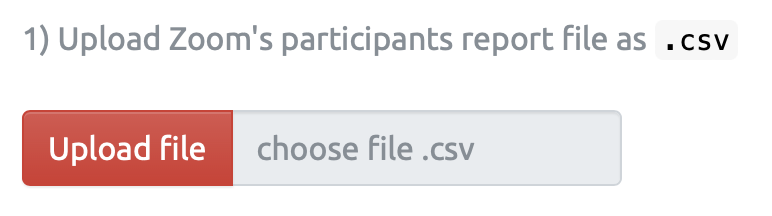

# คู่มือการใช้งาน Zoom Interface App

 

> **Web application ช่วยเช็คชื่อนักศึกษา จาก Zoom participant report
> (`.csv`) และ รวบ Zoom chat file จาก `.txt` เป็น excel**

------------------------------------------------------------------------

**App Link:
[`https://si-physio-intern.shinyapps.io/zoom_interface`](https://si-physio-intern.shinyapps.io/zoom_interface/)**

------------------------------------------------------------------------

### App นี้มีอยู่ 2 menu

1.  **Zoom Class Report:** สำหรับเช็คชื่อนักศึกษา จากรายชื่อ Zoom
    participant report (`.csv`)
2.  **Zoom Chat Converter:** สำหรับแปลงไฟล์ Zoom chat จาก `.txt` เป็น
    excel

------------------------------------------------------------------------

# Zoom Class Report

### วิธีใช้

1.  **Upload Zoom Participant Report** `.csv`
2.  **Choose Time:** Class Start Time, Class End Time, Late Cutoff
3.  **Upload File ID:** ที่มี column `Name` เป็นรายชื่อนักศึกษา และ `ID`
    เป็นรหัสนักศึกษา 7 หลัก
4.  **Results:** สามารถดูผลลัพท์จากตารางที่แสดงใน App และ Download
    ผลเป็น Excel ได้

------------------------------------------------------------------------

## 1. Upload Zoom Participant Report

Zoom participant report เป็นไฟล์ `.csv` ที่ host สามารถ download
มาได้จากโปรแกรม Zoom ซึ่งโดย default แล้ว จะมี column ดังนี้:

-   **Name (Original Name):** เริ่มต้นด้วยชื่อที่แสดงใน Zoom และชื่อ
    Original Name ที่ตั้งไว้ก่อนจะเข้า Zoom ในวงเล็บข้างท้าย
-   **User Email:** เป็น email ที่ผู้เข้าร่วมที่ signed in สำหรับ Zoom
    account
-   **Join Time:** เวลาที่ผู้เข้าร่วม join meeting ในแต่ละ session
-   **Leave Time:** เวลาที่ผู้เข้าร่วม leave meeting ในแต่ละ session
-   **Duration (Minutes):** คิดจาก `Leave Time` - `Join Time` ของแต่ละ
    session
-   **Guest:** “Yes” หมายถึง participants; “No” หมายถึง host
-   **Recording Consent:** “Y” หมายถึงมีการยินยอมให้ record ใน zoom

### รูปตัวอย่าง Zoom Participant Report `.csv`

------------------------------------------------------------------------

## 2. Choose Time

ใส่ **Class Start Time** เป็น เวลาที่เริ่มคาบเรียน และ **Class End
Time** เป็น เวลาที่คาบจบ

หากต้องการคำนวนเวลามาสาย ให้ติ๊กปุ่ม **Add late time ?**

จากนั้นใส่ **Late Time Cutoff** ซึ่งหมายถึง เวลาที่ตัดว่า
ถ้านักเรียนมาเข้า Zoom สายกว่าเวลานี้ จะถือว่าสาย
และจะมีคำนวนเวลาให้ว่าสายกี่นาทีด้วย

 

**สรุป** : จากตัวอย่างในรูปด้านบน ตั้งค่าให้ เวลาเริ่ม 10:00 น. เวลาจบ
12:00 น. โดยตัดสายเมื่อนักเรียนเข้า Zoom ครั้งแรก ช้ากว่า 10:15 น.
เป็นต้นไป

 

**Drop down: Choose units of time interval:**
สำหรับเลือกว่าให้ผลลัพท์ของช่วงเวลาออกมาในหน่วยใด เช่น Minute, Hour,
Second, หรือ Display Text (HMS) คือแสดงเป็นข้อความ

**Significant Digits:** สำหรับเลือกจุดทศนิยมว่ากี่ตำแหน่ง

------------------------------------------------------------------------

## 3. Upload File ID

ให้ Upload file รายชื่อนักศึกษา (File ID) โดยต้องมี column
ที่ตั้งชื่อว่า `Name` มีข้อมูลชื่อนักศึกษา และ column `ID`
มีข้อมูลรหัสนักศึกษา 7 หลัก

------------------------------------------------------------------------

## 4. Results

สามารถดูผลลัพท์จากตารางที่แสดงใน App หรือ Download เป็น Excel file ได้

app นี้จะ extract รหัสนักศึกษา 7 หลักจากชื่อใน Zoom participants report
เข้ามา match กับไฟล์รายชื่อนักศึกษา (File ID) โดยจะแสดงผลในตารางดังนี้

------------------------------------------------------------------------

### Students Summary

ตาราง Students Summary จะสรุปข้อมูลเชิงเวลา ของรหัสนักศึกษา 7
หลักของแต่ละคน ผลลัพท์จะเป็นตารางที่มี column ดังนี้

**Output Columns:**

-   **ID:** รหัสนักศึกษา 7 หลัก ที่ถูกดึงออกมาจาก column
    `Name (Original Name)` ของ Zoom participant report

-   **Name:** รวมรายชื่อทั้งหมดที่พบในแต่ละ `ID` โดยถ้ามี upload ID file
    ด้วย `Name_from_ID` จะแสดงถึงชื่อจาก file ID และ `Name_from_Zoom`
    จะแสดงถึงชื่อจาก Zoom participant report

-   **Email:** รวม Email ของแต่ละ `ID`

-   **Session_Count:** แสดงการนับจำนวนครั้งที่นักเรียนแต่ละคน join หรือ
    leave จากโปรแกรม Zoom

-   **First_Join_Time:** แสดงเวลาที่ join ครั้งแรกสุด ของแต่ละ `ID`

-   **Last_Leave_Time:** แสดงเวลาที่ leave ครั้งสุดท้าย ของแต่ละ `ID`

-   **Before_Class:** แสดงช่วงเวลาที่อยู่ใน zoom **ก่อน** คาบเรียนเริ่ม
    ของแต่ละ `ID`

-   **During_Class:** แสดงช่วงเวลาที่อยู่ใน zoom **ระหว่าง** คาบเรียน
    ของแต่ละ `ID`

-   **After_Class:** แสดงช่วงเวลาที่อยู่ใน zoom **หลัง** คาบเรียนจบ
    ของแต่ละ `ID`

-   **Total_Time:** `Before_Class` + `During_Class` + `After_Class`

-   **Multi_Device:** `TRUE` แสดงว่านักเรียน เข้า Zoom
    ด้วยอุปกรณ์มากกว่า 1 เครื่อง ใน session ใดๆ (โปรแกรมจะดูว่า
    ชื่อนักเรียนแต่ละคนมี session ใน zoom ที่ overlap กันหรือไม่ ถ้ามี
    แสดงว่าใช้อุปกรณ์มากกว่า 1 เข้า zoom)

-   **Late_Time:** ถ้าใส่ “Late Time Cutoff” ใน step 2 ไปแล้ว column
    **Late_Time** นี้แสดงถึงช่วงเวลาที่มาสาย โดยคำนวณจาก
     `First_Join_Time` - `Late Time Cutoff`

------------------------------------------------------------------------

### Missing Names

ตารางนี้จะแสดง rows ที่ไม่พบชื่อนักศึกษาจาก column
`Name_from_ID` หรือ `Name_from_Zoom` ซึ่งจะเป็นการแสดงชื่อนักศึกษาที่มี
`ID` ไม่ match

------------------------------------------------------------------------

### **Individual Sessions**

ตาราง Individual Sessions นี้จะสรุปข้อมูลเชิงเวลา ของแต่ละ session ใน
Zoom ของนักศึกษาแต่ละคน ผลลัพท์จะเป็นตารางที่มี column ดังนี้

**Output Columns:**

-   **Name (Original Name):** จาก column: ‘Name (Original Name)’ ของ
    Zoom participant report

-   **Name:** ชื่อที่ปรากฏใน Zoom ของผู้เข้าร่วม

-   **Name_Original:** ชื่อ Original ที่ตั้งขึ้นก่อนเข้า Zoom

-   **Email:** จาก ‘User Email’ column ของ Zoom participant report

-   **Session:** แสดงถึง active session ใน Zoom ของนักเรียนแต่ละคน
    โดยเป็นการ rank `Join_Time` ในแต่ละกลุ่มของ
    `Name (Original Name)` และ `Email`

-   **Join_Time:** จาก ‘Join Time’ column ของ Zoom participant report

-   **Leave_Time:** จาก ‘Leave Time’ column ของ Zoom participant report

-   **Before_Class:** แสดงช่วงเวลาที่อยู่ใน zoom **ก่อน** คาบเรียนเริ่ม
    ในแต่ละ session

-   **During_Class:** แสดงช่วงเวลาที่อยู่ใน zoom **ระหว่าง** คาบเรียน
    ในแต่ละ session

-   **After_Class:** แสดงช่วงเวลาที่อยู่ใน zoom **หลัง** คาบเรียนจบ
    ในแต่ละ session

-   **Total_Time:** `Before_Class` + `During_Class` + `After_Class`

-   **Rec_Consent:** จาก ‘Recording Consent’ column ของ Zoom participant
    report

-   **Multi_Device:** `TRUE` แสดงว่านักเรียน เข้า Zoom
    ด้วยอุปกรณ์มากกว่า 1 เครื่อง ในแต่ละ session
